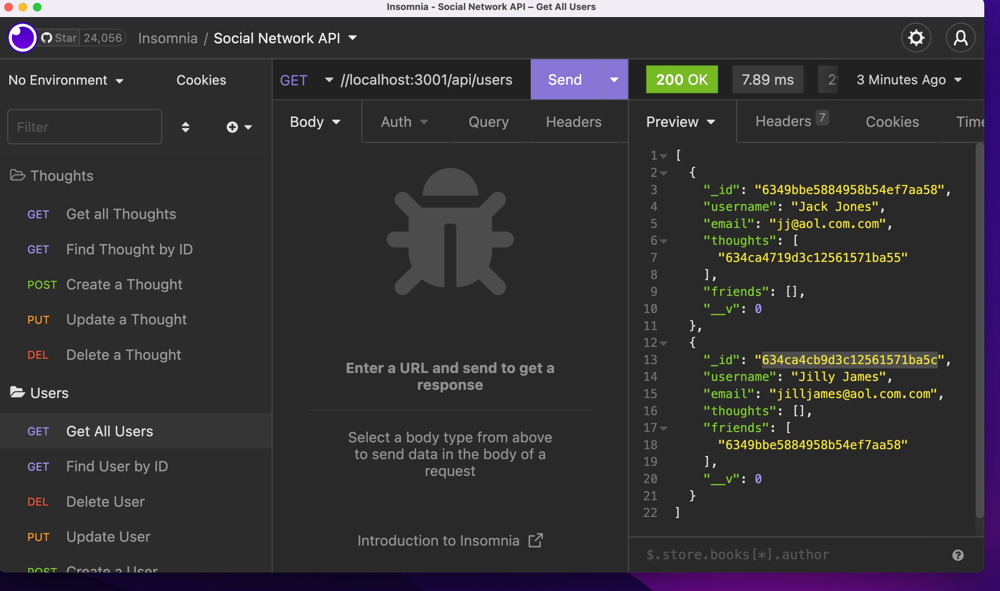

# Social Network API

## Contents

[Description](#description)

[Visuals](#visuals)

[Contributors](#contributors)

## Description
This application has all of the routes necessary to form a social networking program that allows for creation, deletion, updating and retrieving all or one user or user thought. It can also add reactions to thoughts by users as well as allow users to be friends as well as delete frinds and reactions to thoughts. 

## Visuals

Walkthrough Video:
https://drive.google.com/file/d/100b8ebwukThBPzsTA6H93Ms3u29agYSW/view?usp=sharing

## Contributors
Created by Deborah DeeAnn Stelzl